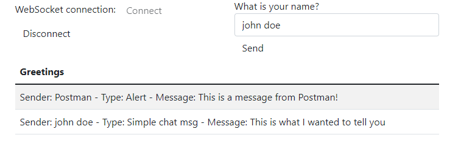

# Esercizio - Spring Boot - Web Socket 2
* scrivere un'applicazione Spring Boot con le dipendenze necessarie che:
  * usa i websocket per inviare un messaggio a tutti i client che si sono iscritti all'argomento `broadcast`
  * espone l'endpoint per l'invio del messaggio su "broadcast-message" che:
    * accetta un payload di `MessageDTO` che ha 2 proprietà:
      * `mittente`
      * `tipo`
      * `messaggio`
  * espone un endpoint (`client-message`) per il client che può inviare `ClientMessageDTO`:
    * un `ClientMessageDTO` ha le seguenti proprietà:
      * `nomecliente`
      * `clientAlert`
      * `clientMsg`
    * quando il server riceve un messaggio dal client, lo invia nuovamente al broadcast
  * ha un frontend simulato che:
    * si connette usando `SockJS`
    * stampa sullo schermo il `MessageDTO`
    * stampa sullo schermo i messaggi che il client invia
* l'output nel browser sarà simile alla seguente immagine:

* inviare un messaggio al cliente abbonato utilizzando `Postman`
* **nota per i revisori**: visualizza `WebSocket2.postman_collection.json` nella cartella principale per tutte le chiamate `Postman`

# Exercise - Spring Boot - Web Socket 2
* write a Spring Boot application with the necessary dependencies that:
  * uses websockets to a message to all the clients that subscribed to the topic `broadcast`
  * exposes the endpoint for sending the message on `broadcast-message` that:
    * accepts a payload of `MessageDTO` that has 2 properties:
      * `sender`
      * `type`
      * `message`
  * exposes an endpoint (`client-message`) for the client that can send `ClientMessageDTO`:
    * a `ClientMessageDTO` has the following properties:
      * `clientName`
      * `clientAlert`
      * `clientMsg`
    * when the server receives a message from the client, it re-sends it to the broadcast
  * has a mocked frontend that:
    * connects using `SockJS`
    * prints on screen the `MessageDTO`
    * prints on screen the messages that the client sends
* the output in the browser will be similar to the following picture:

* send a message to the subscribed client using `Postman`
* **note for reviewers**: view `WebSocket2.postman_collection.json` in the root folder for all the `Postman` calls
